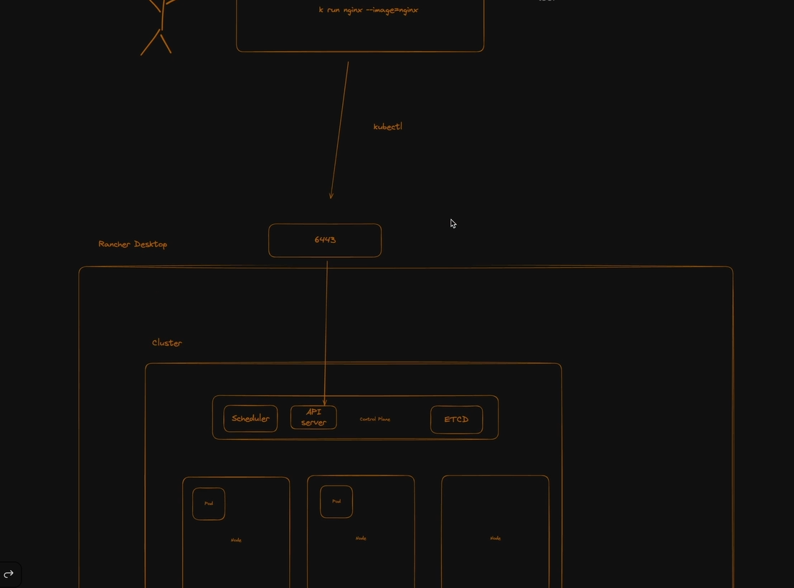

# Kubernetes Fundamentals

## What

- Kubernetes is OS of cloud.
- Kubernetes is bunch of VMs, who are able to properly
  communicate with each other and divide workload.
- Group of worker nodes are called [[Cluster|cluster]] also **context**
- [[Namespaces]] are just logical way of separating things
  in a cluster
- With Kubernetes VMs become **worker nodes**
- Smallest units on kubernetes are called [[Pods|pods]]

## Why

- Can scale up and down your images/containers numbers
- Depending on traffic and load can scale up & down
- If nodes crash can spin up new nodes
- Can automagically calculate how many containers can run on
  specific workder node.
