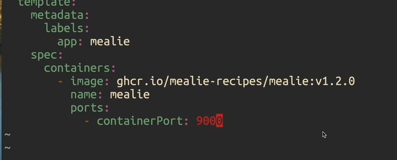

# Networking

- Networking on pod level
- Each pod gets its own IP address
- By default pods can connect to all pods,
  on all nodes using localhost,
  can limit using **network policy**
- use `k get pods -o wide` to see ips

## Services

- [[Pods#Services]]

## Ports

- Specify open ports on pods

- Port forwarding will make port accessible out of cluster
  

## CNI Plugin

- Provides network conctivity and configuration to
  containers
- Assigns IP addresses and route config
- Find out which CNI your cluster is using
  - Usually in `/etc/cni`
