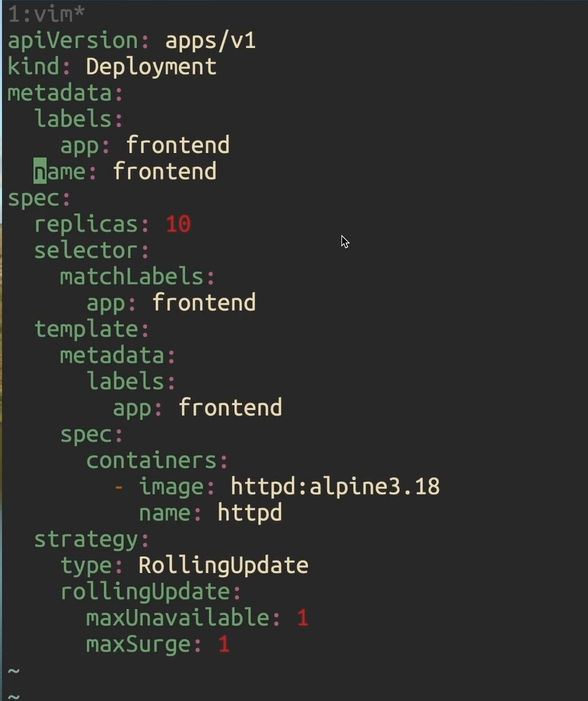
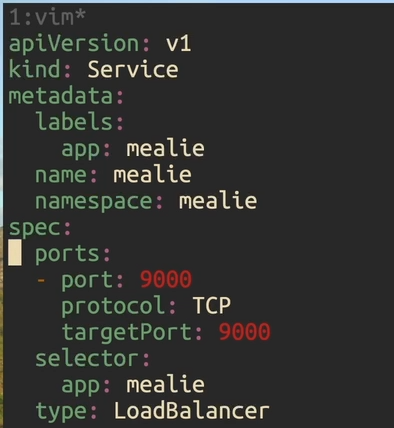

# Services

- Are grouping of pods (eg Frontent Service, Database
  Service where each service includes group of pods)
- We'll point out to service and service will keep track and
  point to it's pods
- Types
  - ClusterIP (default)
  - NodePort (expose a port on all nodes)
  - LoadBalancer (desirable but for prod use [[Ingress]])
- list
  `k get service`

## Expose

- Expose a kubernetes resource as a service
- Deployment [[Deployments]] before expose
  
- expose port
  `k expose deployment deployment_name --port 9000` //not for prod
  `k port-forward service/service_name  9000`
- After expose selector `in -o wide` will point to resource
  
- Service uses label (that is the selector)
- get yaml
  `k get service service_name --dry-run=client -o yaml`
  
- Notce LoadBalancer it's the way to expose the ip and port
  but not fro production for prod we use [[Ingress]]
