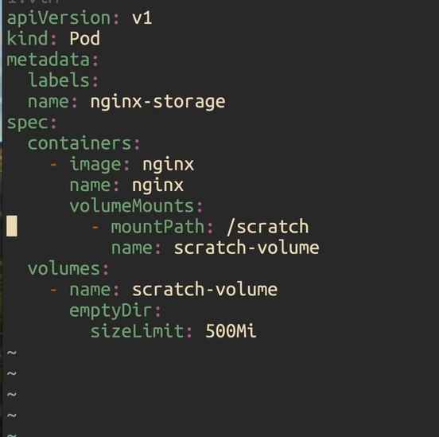
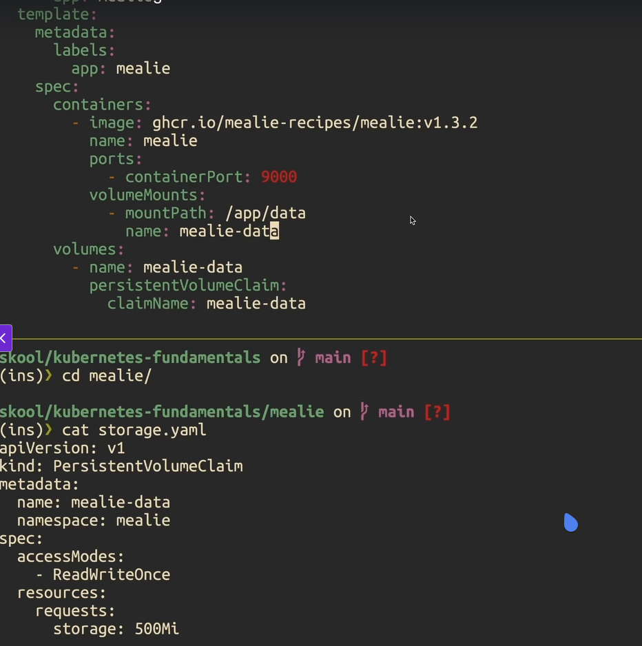

# Storage

- Which container will mount which volume
  

## Ephemeral Storage

- volume of `EmptyDir` type is ephemeral

## Persistent Storage

- Persistent storage can be created and then res can claim
  or res can claim volume and cluster will create the volume
- Storage class is where the actual volume comes from

### Persistent Volume

- `k get persistentvolume`
- `k get persistentvolumeclaims`

### Persistent Volume Claim

- A piece of the volume can be claimed by res

